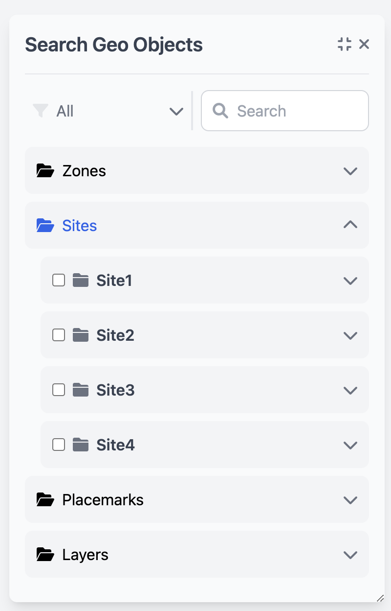

# CityShob

CityShob is an interactive platform designed to facilitate and streamline geo-object searches, offering robust UI components, lazy-loaded categories, and a streamlined, user-friendly experience. Built with Angular 18, RxJS, and Tailwind, CityShob leverages an Angular signal-based state management approach to deliver an efficient, reactive, and highly responsive interface.

---

## Getting Started

Follow these instructions to clone, install, build, and run CityShob locally:

### Installation and Setup

1. **Clone the repository**:
   ```bash
   git clone https://github.com/HackPoint/cityshob.git
   ```
2. **Navigate to the application directory and install dependencies**:
   ```bash
   cd <application-location>
   npm install
   ```
3. **Build the application**:
   ```bash
   nx run widget:build
   ```
4. **Run Docker Compose to start services**:
   ```bash
   docker-compose up --build
   ```
5. **Seed the database** (if required):
   ```bash
   npm run seed
   ```
6. **Seed the database** (if required):
   ```bash
   nx run widget-ui:serve
   ```
7. **Access the application**:
   Open [http://localhost:4200](http://localhost:4200) in your browser.

---
Screenshot:



---
## Questions Answered

### Plugins/Extensions

1. **Tailwind CSS**: Enables rapid, utility-first CSS styling. Tailwind allows for efficient component styling without needing custom CSS, enabling developers to focus on building responsive and consistent UI elements.
2. **RxJS**: Used extensively for state management and reactive programming within Angular components. By leveraging RxJS, CityShob provides a seamless, responsive UI experience.
3. **Docker**: Used to containerize the application, ensuring a consistent environment for development, testing, and deployment. Docker enables simplified setup with `docker-compose` for a full-service local environment.

### Multilingual Support

To implement multilingual support, we would leverage **Angular's i18n library** on the client side. For managing the translations of geo-object names and types, here’s the recommended approach:

1. **Define Translation Keys**: Define translation keys for each category, type, and text item, allowing Angular’s `i18n` service to handle text translations efficiently across components.
2. **Store Translations on Server**: Store translations in JSON or a database, accessible via an API endpoint. This enables language updates without needing client changes.
3. **Dynamic Loading**: Allow the application to request translations based on the user’s language preference. With Angular’s `LOCALE_ID` and `translateService`, the UI would load the relevant language assets dynamically.
4. **User Preferences**: Store the user’s language preference in local storage or as part of the user profile on the server. This allows persistence of language settings across sessions.

### Handling Data Formats

To handle server-sent data in different formats (e.g., PascalCase while using camelCase internally), we would use a mapping solution to reformat the data upon retrieval. For instance, if the server returns `SubCategories` and `Children`, we would convert these to `subCategories` and `children` using an interceptor or a utility function.

#### Example:

```typescript
function formatKeys(obj: any): any {
  if (Array.isArray(obj)) {
    return obj.map((item) => formatKeys(item));
  } else if (obj !== null && typeof obj === 'object') {
    return Object.keys(obj).reduce((acc, key) => {
      const camelCaseKey = key.charAt(0).toLowerCase() + key.slice(1);
      acc[camelCaseKey] = formatKeys(obj[key]);
      return acc;
    }, {} as any);
  }
  return obj;
}
```

### Flowchart

TBD

#### Flowchart Overview

1. **Page Load**: The user opens the page.
2. **Initial Data Fetch**: Default categories are loaded and displayed.
3. **Dropdown Selection**: The user selects a category from the dropdown.
  - **Dropdown Update**: Updates the UI with the chosen category and triggers data filtering.
4. **Search Interaction**: The user enters search terms.
  - **Filtered Fetch**: Based on search terms, a filtered data request is sent.
  - **Results Displayed**: Matching categories and subcategories are shown.
5. **Lazy Loading in Accordion**: When expanding a category, lazy-loaded data retrieval occurs only for that section.

---

## Additional Information

This project utilizes Angular’s latest features, including signals and reactive state management, for optimal performance. Tailwind CSS provides the styling foundation, ensuring a visually consistent and responsive UI. Docker streamlines setup and ensures compatibility across development and production environments.
